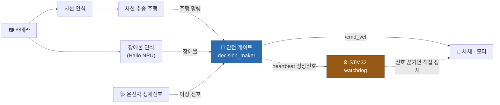
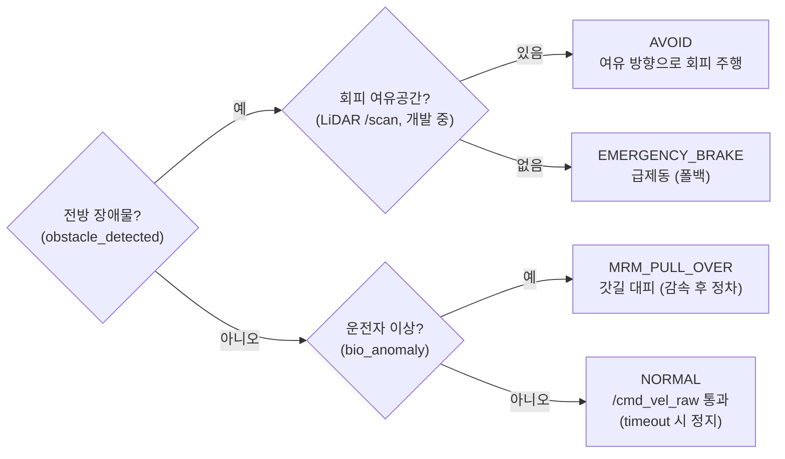

<!-- markdownlint-disable MD033 MD041 -->

# 🚗 SafeCar

**운전자 이상·전방 장애물을 감지해 스스로 안전 조치를 취하는 자율주행 안전 감독(fail-safe) 시스템**

STELLA N1 차체 · Raspberry Pi 5 · Hailo-8 NPU 기반 ROS 2 자율주행 플랫폼

---

## 📌 프로젝트 정보

| 항목 | 내용 |
|---|---|
| **개발 기간** | 2026.05.07 ~ 2026.09.30 |
| **소속 / 과목** | 영남대학교 2026 융합 Capstone Design Project |
| **팀 구성** | 4인 (인지 · 제어 · 통신 · 대시보드) |
| **기반 플랫폼** | STELLA N1 (Raspberry Pi 5 + Hailo-8 AI HAT + YDLIDAR X4) |
| **미들웨어** | ROS 2 Jazzy |

---

## 👥 팀 소개

| 파트 | 담당 | 주요 패키지 |
|---|---|---|
| 🧭 제어 · 통합 | 김승제 | `safecar_control`, `safecar_bringup` |
| 👁️ 인지 | 진다혜 | `safecar_perception` |
| 📡 통신 | 정수영 | `safecar_comms` |
| 📊 대시보드 | 성현서 | `safecar_dashboard` |

---

## 📖 프로젝트 소개

SafeCar는 일반 자율주행 스택 위에 **"안전 감독(supervisor) 레이어"** 를 얹은 프로젝트입니다.

- **문제의식** — 자율주행 중 ① 운전자의 갑작스러운 건강 이상, ② 전방 장애물, ③ 주 연산장치(라즈베리파이) 자체 고장 같은 상황에서도 차량이 스스로 사고 없이 안전하게 대응해야 한다.
- **핵심 아이디어** — NTREX STELLA 차체 위에 **인지(카메라·NPU) → 판단(제어) → 통신(센서)** 3계층 SafeCar 레이어를 추가하고, 실제 바퀴로 나가는 `/cmd_vel`을 **단일 안전 게이트**로 통제한다. 나아가 **소프트웨어(라즈베리파이)가 멈춰도 동작하는 하드웨어 최후 방어선(STM32 CAN watchdog)** 으로 안전을 이중화한다.
- **3가지 안전 시나리오**
  - 🫀 **운전자 생체 이상** → 감속하며 우측 갓길로 이동 후 정차 (MRM 로직 구현)
  - 🚧 **전방 장애물** → Hailo NPU로 감지해 정지(동작 확인). 단순 정지를 넘어 여유 공간으로 **회피 주행** 하도록 개발 중
  - ⚙️ **라즈베리파이 고장** → 정상신호가 끊기면 **STM32가 CAN으로 이어받아 서서히 정지** (개발 중)
- **결과** — 실내 트랙에서 **OpenCV 기반 차선 추종 자율주행** 을 실제 차량에서 end-to-end로 검증했고, **Hailo-8 NPU 장애물 감지 → 정지** 동작을 확인했다.

`/cmd_vel` 게이트는 **전방 장애물(정지/회피) → 운전자 이상(갓길 대피) → 정상 주행** 순으로 가장 위급한 상황을 먼저 처리하며, 그 위에 소프트웨어가 죽어도 작동하는 STM32 하드웨어 watchdog을 이중으로 둔다.

---

## 🛠️ 기술 스택

**Robotics / 미들웨어**

**언어**

**비전 / AI**

**하드웨어**

-6A1B9A)

| 분류 | 사용 기술 |
|---|---|
| 미들웨어 | ROS 2 Jazzy, colcon |
| 제어 · 인지 · 통신 노드 | Python |
| 차체 드라이버 (모터 · IMU · LiDAR) | C++ |
| 차선 인식 | OpenCV (HSV 마스크 + P/D 조향) |
| 객체 인식 | Hailo-8 NPU, YOLOv8n (`.hef`) |
| 센서 · MCU | Camera Module 3 (imx708/CSI), YDLIDAR X4, STM32 (CAN watchdog, 개발 중) |

---

## 🏗️ 전체 시스템 아키텍처

> 모든 주행 명령은 **안전 게이트** 하나를 거쳐 바퀴로 나가고, 소프트웨어가 멈추면 **STM32**가 직접 멈춥니다.

### 판단 로직 (decision_maker)

> 📂 패키지 구성 · 토픽 계약 · 빌드/실행 상세는 **[`docs/ARCHITECTURE.md`](./docs/ARCHITECTURE.md)** 에 정리되어 있습니다.

---

## 📚 참고문헌

- **NTREX STELLA_N5_ROS2** — 차체 베이스 플랫폼 · https://github.com/ntrexlab/STELLA_N5_ROS2 (출처/변경 이력: [`NOTICE.md`](./NOTICE.md))
- **Hailo hailo-rpi5-examples** — Hailo-8 NPU 추론 예제 · https://github.com/hailo-ai/hailo-rpi5-examples
- **camera_ros** — Raspberry Pi CSI 카메라 ROS 2 드라이버 · https://github.com/christianrauch/camera_ros
- **Ultra-Fast-Lane-Detection (UFLD)** — 딥러닝 차선 인식 (실험) · https://github.com/cfzd/Ultra-Fast-Lane-Detection
- **YOLOv8 (Ultralytics)** — 객체 인식 모델 · https://github.com/ultralytics/ultralytics
- **ROS 2 Jazzy 공식 문서** · https://docs.ros.org/en/jazzy/
