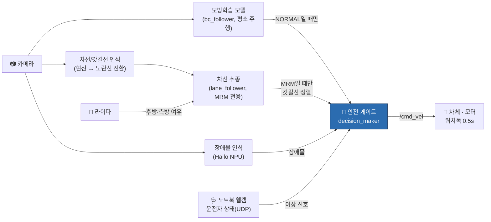
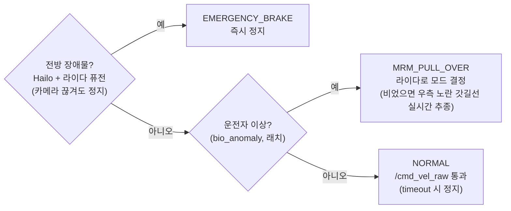

<!-- markdownlint-disable MD033 MD041 -->

# 🚗 SafeCar

**운전자 이상·전방 장애물을 감지해 스스로 안전 조치를 취하는 자율주행 안전 감독(fail-safe) 시스템**

STELLA N1 차체 · Raspberry Pi 5 · Hailo-8 NPU 기반 ROS 2 자율주행 플랫폼

---

## 📌 프로젝트 정보

| 항목 | 내용 |
|---|---|
| **개발 기간** | 2026.05.07 ~ 2026.09.30 |
| **소속 / 과목** | 영남대학교 2026 융합 Capstone Design Project |
| **팀 구성** | 4인 (인지 · 제어 · 통신 · 대시보드) |
| **기반 플랫폼** | STELLA N1 (Raspberry Pi 5 + Hailo-8 AI HAT + YDLIDAR X4) |
| **미들웨어** | ROS 2 Jazzy |

---

## 👥 팀 소개

| 파트 | 담당 | 주요 패키지 |
|---|---|---|
| 🧭 제어 · 통합 | 김승제 | `safecar/safecar/control/`, `safecar/launch/` |
| 👁️ 인지 | 진다혜 | `safecar/safecar/perception/` |
| 📡 통신 | 정수영 | `safecar/safecar/comms/` + 노트북 웹캠 졸음 감지(`driver_monitor/`) |
| 📊 대시보드 | 성현서 | (미구현 — 패키지 정리됨) |

---

## 📖 프로젝트 소개

SafeCar는 일반 자율주행 스택 위에 **"안전 감독(supervisor) 레이어"** 를 얹은 프로젝트입니다.

- **문제의식** — 자율주행 중 ① 운전자의 갑작스러운 건강 이상, ② 전방 장애물, ③ 제어 스택 자체의 정지 같은 상황에서도 차량이 스스로 사고 없이 안전하게 대응해야 한다.
- **핵심 아이디어** — NTREX STELLA 차체 위에 **인지(카메라·NPU) → 판단(제어) → 통신(센서)** 3계층 SafeCar 레이어를 추가하고, 실제 바퀴로 나가는 `/cmd_vel`을 **단일 안전 게이트**로 통제한다. 나아가 **스택이 멈춰도 동작하는 차체 드라이버 워치독**으로 안전을 이중화한다.
- **주행은 두 방식을 상황에 따라 전환한다** — 평소엔 사람 조종 데이터로 학습한 **모방학습(behavior cloning) 모델**이 몰고, 운전자 이상이 감지되면 규칙기반 `lane_follower_node`가 조용히 이어받아 **갓길(노란 테이프) 실시간 인식**으로 붙여 정차시킨다. 두 노드가 같은 안전 게이트 상태를 보고 한쪽만 활성화되므로 서로 충돌하지 않는다.
- **3가지 안전 시나리오**
  - 🫀 **운전자 생체 이상** → 노트북 웹캠(모방학습 기반 얼굴 랜드마크)이 3초 이상 눈감김을 감지 → UDP로 신호 전달 → 감속하며 **실제 갓길선(노란 테이프)을 카메라로 보고** 우측으로 붙어 정차 (MRM 구현, R157 재출발 금지 래치 포함)
  - 🚧 **전방 장애물** → Hailo NPU + 라이다 퓨전으로 감지해 즉시 정지(동작 확인). 옆 차로로 피해 계속 달리는 회피주행은 이번 범위 밖으로, 향후 과제로 남겨둔다
  - ⚙️ **스택 다운** → `/cmd_vel`이 0.5초 끊기면 **차체 드라이버가 스스로 모터 정지** (구현 완료)
- **결과** — 실외 트랙에서 **모방학습 기반 자율주행**과 **OpenCV 규칙기반 차선 추종**을 둘 다 실제 소형 차체에서 end-to-end로 검증했고, **Hailo-8 NPU + 라이다 퓨전 장애물 감지 → 정지** 동작을 확인했다.

`/cmd_vel` 게이트는 **전방 장애물(정지) → 운전자 이상(갓길 대피) → 정상 주행** 순으로 가장 위급한 상황을 먼저 처리하고, 그 아래에 스택이 죽어도 동작하는 차체 드라이버 워치독을 이중으로 둔다.

---

## 🛠️ 기술 스택

**Robotics / 미들웨어**

**언어**

**비전 / AI**

**하드웨어**

-6A1B9A)

| 분류 | 사용 기술 |
|---|---|
| 미들웨어 | ROS 2 Jazzy, colcon |
| 제어 · 인지 · 통신 노드 | Python |
| 차체 드라이버 (모터 · IMU · LiDAR) | C++ |
| 차선 인식 (규칙기반) | OpenCV (HSV 마스크 + Hough 변환 + P/헤딩 조향) |
| 자율주행 (모방학습) | PyTorch(학습) → ONNX → OpenCV DNN(Pi 추론), PilotNet 경량판 |
| 운전자 상태 감시 | MediaPipe FaceMesh (EAR 기반 눈감김 판정), 노트북에서 실행 |
| 객체 인식 | Hailo-8 NPU, YOLOv8n (`.hef`) |
| 센서 | Camera Module 3 (imx708/CSI), YDLIDAR X4 (360°, 0.12~10m) |

---

## 🏗️ 전체 시스템 아키텍처

```mermaid
%%{init: {'flowchart': {'nodeSpacing': 100, 'rankSpacing': 90}, 'themeVariables': {'fontSize': '22px'}}}%%
flowchart LR
    CAM["📷 카메라"] --> BC["모방학습 모델<br/>(bc_follower, 평소 주행)"]
    CAM --> LANE["차선/갓길선 인식<br/>(흰선 ↔ 노란선 전환)"]
    CAM --> OBJ["장애물 인식<br/>(Hailo NPU)"]
    LANE --> RULE["차선 추종<br/>(lane_follower, MRM 전용)"]

    BC -->|"NORMAL일 때만"| GATE
    RULE -->|"MRM일 때만<br/>갓길선 정렬"| GATE
    OBJ -->|장애물| GATE
    BIO["🩺 노트북 웹캠<br/>운전자 상태(UDP)"] -->|이상 신호| GATE

    LIDAR["📡 라이다"] -->|후방·측방 여유| RULE
    GATE["🧭 안전 게이트<br/>decision_maker"] -->|"/cmd_vel"| CAR["🚗 차체 · 모터<br/>워치독 0.5s"]

    style GATE fill:#2b6cb0,stroke:#1a365d,color:#ffffff
```

> 모든 주행 명령은 **안전 게이트** 하나를 거쳐 바퀴로 나가고, 스택이 멈추면 **차체 드라이버**가 직접 멈춥니다. `bc_follower`와 `lane_follower`는 항상 같이 떠 있지만 `driving_state`를 보고 **한쪽만 발행**하므로 서로 싸우지 않습니다 — MRM 중엔 인지부가 흰선 대신 갓길 노란선을 보도록 전환됩니다.

### 판단 로직 (decision_maker)

```mermaid
flowchart LR
    A{"전방 장애물?<br/>Hailo + 라이다 퓨전<br/>(카메라 끊겨도 정지)"} -- 예 --> E["EMERGENCY_BRAKE<br/>즉시 정지"]
    A -- 아니오 --> B{"운전자 이상?<br/>(bio_anomaly, 래치)"}
    B -- 예 --> M["MRM_PULL_OVER<br/>라이다로 모드 결정<br/>(비었으면 우측 노란 갓길선 실시간 추종)"]
    B -- 아니오 --> N["NORMAL<br/>/cmd_vel_raw 통과<br/>(timeout 시 정지)"]
```

> 📂 패키지 구성 · 토픽 계약 · 빌드/실행 상세는 **[`docs/ARCHITECTURE.md`](./docs/ARCHITECTURE.md)** 에 정리되어 있습니다.

---

## 📚 참고문헌

- **NTREX STELLA_N5_ROS2** — 차체 베이스 플랫폼 · https://github.com/ntrexlab/STELLA_N5_ROS2 (출처/변경 이력: [`NOTICE.md`](./NOTICE.md))
- **Hailo hailo-rpi5-examples** — Hailo-8 NPU 추론 예제 · https://github.com/hailo-ai/hailo-rpi5-examples
- **camera_ros** — Raspberry Pi CSI 카메라 ROS 2 드라이버 · https://github.com/christianrauch/camera_ros
- **YOLOv8 (Ultralytics)** — 객체 인식 모델 · https://github.com/ultralytics/ultralytics
- **ROS 2 Jazzy 공식 문서** · https://docs.ros.org/en/jazzy/

### 안전 규격 · 선행기술

MRM(최소위험동작)과 운전자 상태 감시(DMS) 설계의 근거 문헌.

- **KR 공개특허 10-2024-0073259** — 「자율주행을 위한 MRM(최소위험동작) 장치와 방법 및 MRM 모드 결정 방법」, 한국전자통신연구원(ETRI), 2024.05.27 공개 (출원 10-2022-0154383)
  → MRM 6모드 정의와 모드 결정 플로우(청구항 13~16). 본 프로젝트는 이 중 **비상정차·직진정차·자차로정차·우차로정차** 4개를 구현.
- **UN Regulation No. 157 (ALKS)** — 최소위험조작의 규제상 정의, 정차 후 수동 입력 전 재출발 금지 · https://unece.org/sites/default/files/2025-06/R157r1e.pdf
- **EU 2021/1341 (DDAW)** — 졸음 경고 의무 기준(KSS 8 이상) · https://eur-lex.europa.eu/legal-content/EN/TXT/HTML/?uri=CELEX:32021R1341
- **Euro NCAP, "Safe Driving — Driver Engagement" Protocol, Version 1.1, October 2025**, §1.3.3–1.3.5 · https://cdn.euroncap.com/cars/assets/euro_ncap_protocol_safe_driving_driver_engagement_v11_a30e874152.pdf
  → 원문 대조 완료. Microsleep(1~2초)·Sleep(≥3초)·Unresponsive(≥6초) 판정 시간이 `driver_monitor/drowsy_v5.py`의 상수(`MICROSLEEP_SEC`/`SLEEP_SEC`/`UNRESPONSIVE_SEC`) 그대로다.
- **PERCLOS** (Wierwille et al., NHTSA) — 눈 감김 비율 기반 졸음 지표(P80) · https://rosap.ntl.bts.gov/view/dot/113

### 모방학습(behavior cloning)

- **Bojarski, M. et al., "End to End Learning for Self-Driving Cars"**, NVIDIA, 2016 · https://arxiv.org/abs/1604.07316
  → `PilotNet` 원 논문. `scripts/train_bc.py`의 CNN이 이 구조를 경량화한 것.
