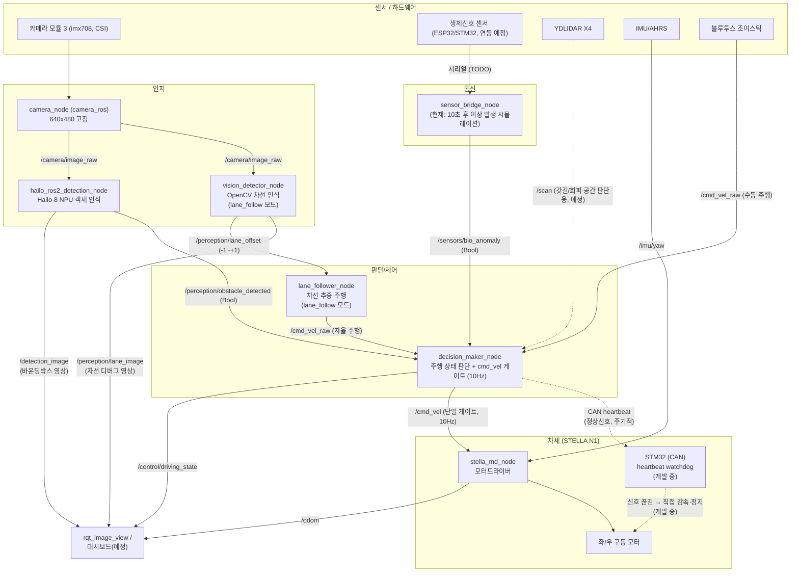
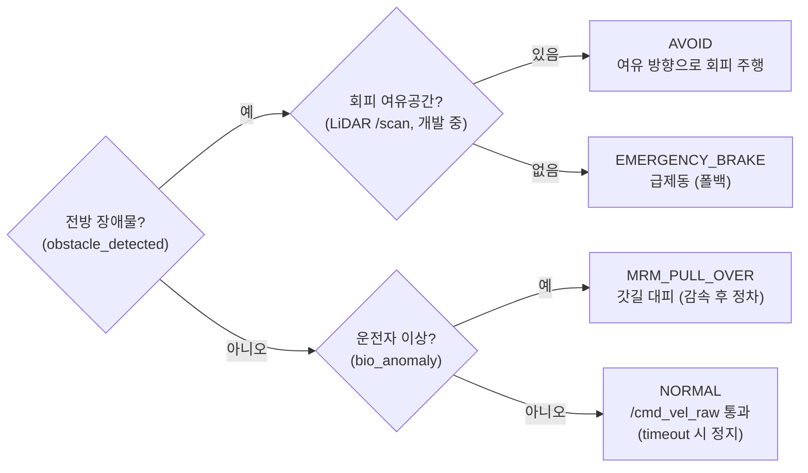

# cdp_ws — SafeCar ROS2 워크스페이스

STELLA N1 차체(라즈베리파이 5 + Hailo-8 AI HAT + ESP32/STM32) 기반 안전 감독(fail-safe) 시스템.

NTREX의 [STELLA_N5_ROS2](https://github.com/ntrexlab/STELLA_N5_ROS2)를 기반으로,
실제 차체(STELLA N1, YDLIDAR X4 단일 라이다)에 맞게 불필요한 패키지를 정리하고
그 위에 카메라 인지 + 상황 판단 + 외부 센서 브릿지(SafeCar 레이어)를 추가했다.
자세한 출처/변경 이력은 [`NOTICE.md`](./NOTICE.md) 참고.

## 패키지 구성

```
cdp_ws/
├── stella/                    # 차체 하드웨어 드라이버 (NTREX 원본, 유지)
│   ├── stella_md/             # 모터드라이버 — '/cmd_vel' 구독, '/odom' publish
│   ├── stella_ahrs/           # IMU/AHRS — '/imu/yaw' publish
│   └── ydlidar_ros/           # YDLIDAR X4 — '/scan' publish
├── stella_bringup/            # 차체 기본 구동 launch (단순화됨: 조건 분기 없음)
├── stella_description/        # URDF (기본 variant만 유지)
├── stella_hailo_rpi5_ros2_examples/  # Hailo-8 + Pi5 객체인식 예제 (NTREX 원본, 유지)
├── stella_teleop_bluetooth/   # 블루투스 조이스틱 원격조종 (유지, 평상시 주행용)
├── safecar/                   # SafeCar 안전 감독 레이어 (직접 추가)
│   ├── safecar_msgs/          # 공용 명령어 상수
│   ├── safecar_perception/    # 인지부 — 차선/장애물 인식
│   ├── safecar_control/       # 제어부 — 상황 판단, cmd_vel 개입
│   ├── safecar_comms/         # 통신부 — ESP32/STM32 센서 브릿지
│   └── safecar_dashboard/     # 대시보드 (방식 미정, 자리만)
└── safecar_bringup/           # 통합 launch (stella_bringup + camera_ros + safecar 노드)
```

## 시스템 블록도 (전체 작동 과정)



> **안전 게이트**: `/cmd_vel`은 decision_maker만 publish한다. 주행 명령(teleop, 추후
> 차선 추종 노드)은 `/cmd_vel_raw`로 보내야 하며, NORMAL일 때만 통과되고 비상 시 차단된다.
> `/cmd_vel_raw`가 `cmd_vel_timeout`(기본 1초) 이상 끊기면 정지 명령을 발행한다
> (stella_md에 자체 타임아웃이 없어 통신 단절 시 마지막 속도로 계속 달리는 문제 방지).
> teleop 실행 시 remap 필수 — cdp-remotepc README의 `/cmd_vel_raw` remap 명령 참고.
>
> **하드웨어 최후 방어선(개발 중)**: 위 게이트는 소프트웨어(라즈베리파이) 위에서 동작하므로 연산부 자체가 죽으면 무력하다.
> 이를 대비해 라즈베리파이가 주기적으로 정상신호(heartbeat)를 CAN으로 STM32에 보내고, 이 신호가 일정 시간 끊기면
> STM32가 제어를 이어받아 모터를 직접 서서히 감속·정지시킨다.

### 판단 로직 (decision_maker)



## 제거한 것 (원본 STELLA_N5_ROS2 대비)

실제 하드웨어(YDLIDAR X4 단일 라이다, RealSense 없음, USB캠 아닌 CSI 카메라)에 맞지 않는 것들을 정리했다.

- `realsense-ros`, `stella_pointcloud_handler` — RealSense 깊이 카메라용, 미사용
- `sllidar_ros2`, `sllidar2_ros2` — SLAMTEC RPLIDAR용, YDLIDAR X4만 쓰므로 미사용
- `stella_bringup`의 RealSense/웹캠 launch 분기, `robot_launch_param.yaml` — 조건 없는 단일 구성으로 대체
- `stella_description`의 RealSense/웹캠 URDF variant

## 외부 의존성 (이 워크스페이스에 없음, 별도 설치 필요)

- **`camera_ros`** — 라즈베리파이 카메라 모듈(CSI/libcamera) ROS2 드라이버. `/camera/image_raw` publish.
  https://github.com/christianrauch/camera_ros 를 `src/`에 clone 후 빌드.
- **Hailo 객체 인식 런타임** — `stella_hailo_rpi5_ros2_examples/ReadMe.md` 안내대로
  [hailo-rpi5-examples](https://github.com/hailo-ai/hailo-rpi5-examples) 저장소를 별도로 설치해야
  `stella_hailo_rpi5_ros2_examples` 패키지가 동작한다. (현재 `safecar_perception`은 이것 없이도
  OpenCV 차선 인식 + 임시 장애물 인식 로직만으로 동작한다.)

## 빌드 & 실행

```bash
colcon build
source install/setup.bash

# 기본(수동/teleop 주행, 10초 뒤 운전자 이상 시뮬레이션 발동)
ros2 launch safecar_bringup safecar.launch.py

# 차선 추종 자율주행 (시뮬레이션 끔 — 트랙 테스트용)
ros2 launch safecar_bringup safecar.launch.py lane_follow:=true anomaly_delay_sec:=-1.0
```

launch 인자:

| 인자 | 기본값 | 설명 |
|---|---|---|
| `lane_follow` | `false` | true면 차선 인식+추종 노드 실행(자율주행). teleop과 동시 사용 금지 |
| `anomaly_delay_sec` | `10.0` | N초 후 운전자 이상 시뮬레이션. 0 이하 = 비활성 |

## 토픽 계약

| 토픽 | 타입 | Publisher | Subscriber |
|---|---|---|---|
| `/camera/image_raw` | sensor_msgs/Image | camera_ros (640x480) | stella_hailo_rpi5_ros2_examples |
| `/perception/obstacle_detected` | std_msgs/Bool | stella_hailo_rpi5_ros2_examples (Hailo-8 실추론) | safecar_control |
| `/detection_image` | sensor_msgs/Image | stella_hailo_rpi5_ros2_examples | (디버그/대시보드용, 바운딩박스 영상) |
| `/sensors/bio_anomaly` | std_msgs/Bool | safecar_comms | safecar_control |
| `/control/driving_state` | std_msgs/String | safecar_control | (대시보드/로깅용) |
| `/perception/lane_offset` | std_msgs/Float32 | safecar_perception (차선 찾은 프레임만, -1~+1) | safecar_control (lane_follower) |
| `/perception/lane_image` | sensor_msgs/Image | safecar_perception | (디버그/튜닝용, 차선 검출 시각화) |
| `/cmd_vel_raw` | geometry_msgs/Twist | teleop(VM, remap 필수) 또는 lane_follower (동시 사용 금지) | safecar_control |
| `/cmd_vel` | geometry_msgs/Twist | safecar_control (단일 게이트, 10Hz) | stella_md |
| `/imu/yaw` | std_msgs/Float64 | stella_ahrs | stella_md |
| `/scan` | sensor_msgs/LaserScan | ydlidar_ros | (필요 시 safecar_control, 갓길 공간 확보 판단용) |
| `/odom` | nav_msgs/Odometry | stella_md | (대시보드/로깅용) |

새 명령어 값이나 상태가 필요하면 `safecar/safecar_msgs/safecar_msgs/command_protocol.py`만 고치면 된다.
