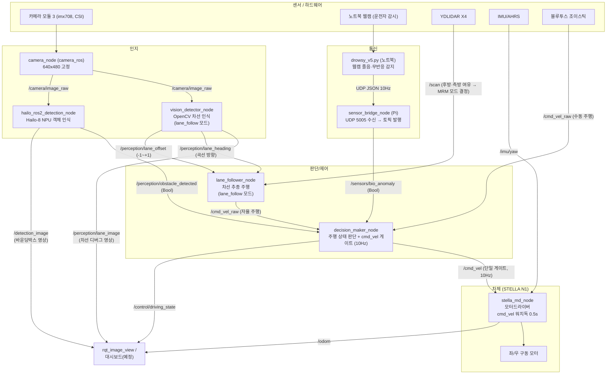
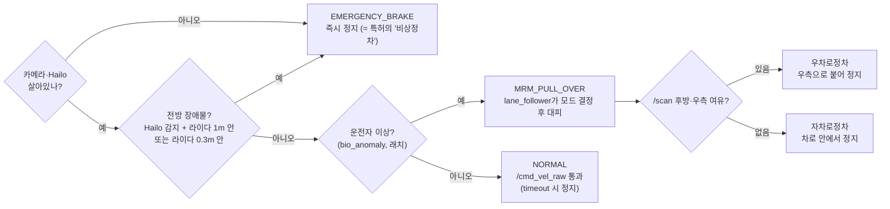

# 2026_CDP — SafeCar ROS2 워크스페이스

STELLA N1 차체(라즈베리파이 5 + Hailo-8 AI HAT + YDLIDAR X4) 기반 안전 감독(fail-safe) 시스템.

NTREX의 [STELLA_N5_ROS2](https://github.com/ntrexlab/STELLA_N5_ROS2)를 기반으로,
실제 차체(STELLA N1, YDLIDAR X4 단일 라이다)에 맞게 불필요한 패키지를 정리하고
그 위에 카메라 인지 + 상황 판단 + 외부 센서 브릿지(SafeCar 레이어)를 추가했다.
자세한 출처/변경 이력은 [`NOTICE.md`](./NOTICE.md) 참고.

## 패키지 구성

```
2026_CDP/
├── safecar/                   # SafeCar 안전 감독 레이어 — 이 프로젝트에서 작성한 코드 (ROS 패키지 하나)
│   ├── launch/
│   │   ├── safecar.launch.py      # 통합 실행 (차체 + 센서 + 인지 + 게이트). 실행 경로는 이것 하나
│   │   └── manual_drive.launch.py # 수동 주행·촬영용 (차체 + 카메라만)
│   └── safecar/
│       ├── protocol.py            # 공용 주행 상태 상수 (NORMAL / EMERGENCY_BRAKE / MRM_PULL_OVER)
│       ├── perception/            # 인지 (진다혜) — 차선 인식
│       ├── control/               # 제어 (김승제) — 안전 게이트, 차선 추종, 갓길 대피(MRM)
│       └── comms/                 # 통신 (정수영) — 운전자 이상 신호 브릿지(+시뮬)
├── stella/                    # 벤더 코드 (NTREX STELLA 기반, 거의 수정하지 않음)
│   ├── stella_md/                 # 모터드라이버 — '/cmd_vel' 구독, '/odom' publish, 0.5s 워치독
│   ├── stella_ahrs/               # IMU/AHRS — '/imu/yaw' publish
│   ├── ydlidar_ros/               # YDLIDAR X4 — '/scan' publish (패키지명 ydlidar)
│   ├── stella_bringup/            # 차체 구동부 launch (md + ahrs + lidar)
│   └── stella_hailo_rpi5_ros2_examples/  # Hailo-8 NPU 객체 인식
├── driver_monitor/            # 노트북(윈도우)에서 실행 — 웹캠 졸음 감지 → UDP로 Pi에 전송 (ROS 아님)
├── scripts/                   # Pi 운영 스크립트(pi/) + 진단 도구(scan_check, image_server, record_dataset)
└── docs/
```

> 예전에는 담당자별로 ROS 패키지를 나눴다(코드 약 1천 줄에 패키지 5개, 설정 파일 25개).
> 2026-09-21에 `safecar` 패키지 하나로 합치고 담당 영역은 하위 폴더로 구분했다.

## 실행 머신 (누가 어디서 도나)

| 실행 머신 | 코드 | 담당 | 내용 |
|---|---|---|---|
| Raspberry Pi 5 (차체) | `safecar/`, `stella/` | 김승제 · 진다혜 · 정수영(`comms/`) | 차선 인식 · 차선 추종 · 안전 게이트 · 차체 드라이버 · UDP 수신 |
| 노트북 (윈도우, ROS 없음) | `driver_monitor/drowsy_v5.py` | 정수영 | 웹캠 운전자 졸음·무반응 감지 |

두 기계의 접점은 **UDP 5005 포트 하나뿐**이다. 노트북이 운전자 상태를 초당 10회 보내면
Pi의 `sensor_bridge_node`가 받아 `/sensors/bio_anomaly`로 발행한다.
규약·latch·끊김 처리·독립 테스트 방법은 [`docs/DRIVER_SIGNAL_CONTRACT.md`](DRIVER_SIGNAL_CONTRACT.md) 참고.

**주행은 Pi 단독으로 완결됩니다** — 자율주행 루프에 외부 기계로 나가는 신호가 없어, 네트워크가 끊겨도 주행은 계속됩니다. 노트북이 필요한 건 웹캠 운전자 감지뿐이고, 개발·점검은 SSH + `scripts/`의 진단 도구로 합니다(카메라 영상은 브라우저, 라이다는 텍스트 출력). 우분투 VM(`cdp-remotepc`)은 rqt/rviz를 쓰고 싶을 때만 켜면 됩니다.

## 시스템 블록도 (전체 작동 과정)


```mermaid
flowchart TD
    subgraph HW["센서 / 하드웨어"]
        CAM["카메라 모듈 3 (imx708, CSI)"]
        BIOHW["노트북 웹캠 (운전자 감시)"]
        LIDAR["YDLIDAR X4"]
        IMU["IMU/AHRS"]
        JOY["블루투스 조이스틱"]
    end

    subgraph PERCEPTION["인지"]
        CAMNODE["camera_node (camera_ros)<br/>640x480 고정"]
        HAILO["hailo_ros2_detection_node<br/>Hailo-8 NPU 객체 인식"]
        VD["vision_detector_node<br/>OpenCV 차선 인식<br/>(lane_follow 모드)"]
    end

    subgraph COMMS["통신"]
        DMS["drowsy_v5.py (노트북)<br/>웹캠 졸음·무반응 감지"]
        BRIDGE["sensor_bridge_node (Pi)<br/>UDP 5005 수신 → 토픽 발행"]
        DMS -- "UDP JSON 10Hz" --> BRIDGE
    end

    subgraph CONTROL["판단/제어"]
        DM["decision_maker_node<br/>주행 상태 판단 + cmd_vel 게이트 (10Hz)"]
        LF["lane_follower_node<br/>차선 추종 주행<br/>(lane_follow 모드)"]
    end

    subgraph BASE["차체 (STELLA N1)"]
        MD["stella_md_node<br/>모터드라이버<br/>cmd_vel 워치독 0.5s"]
        MOTOR["좌/우 구동 모터"]
    end

    CAM --> CAMNODE
    BIOHW --> DMS
    CAMNODE -- "/camera/image_raw" --> HAILO
    HAILO -- "/detection_image<br/>(바운딩박스 영상)" --> VIEW["rqt_image_view /<br/>대시보드(예정)"]
    HAILO -- "/perception/obstacle_detected (Bool)" --> DM
    BRIDGE -- "/sensors/bio_anomaly (Bool)" --> DM
    DM -- "/control/driving_state" --> VIEW
    CAMNODE -- "/camera/image_raw" --> VD
    VD -- "/perception/lane_offset (-1~+1)" --> LF
    VD -- "/perception/lane_heading (곡선 방향)" --> LF
    VD -- "/perception/lane_image<br/>(차선 디버그 영상)" --> VIEW
    LF -- "/cmd_vel_raw (자율 주행)" --> DM
    JOY -- "/cmd_vel_raw (수동 주행)" --> DM
    DM -- "/cmd_vel (단일 게이트, 10Hz)" --> MD
    LIDAR -- "/scan (후방·측방 여유 → MRM 모드 결정)" --> LF
    IMU -- "/imu/yaw" --> MD
    MD -- "/odom" --> VIEW
    MD --> MOTOR
```

> **안전 게이트**: `/cmd_vel`은 decision_maker만 publish한다. 주행 명령(teleop, 추후
> 차선 추종 노드)은 `/cmd_vel_raw`로 보내야 하며, NORMAL일 때만 통과되고 비상 시 차단된다.
> `/cmd_vel_raw`가 `cmd_vel_timeout`(기본 1초) 이상 끊기면 정지 명령을 발행한다
> (stella_md에 자체 타임아웃이 없어 통신 단절 시 마지막 속도로 계속 달리는 문제 방지).
> teleop 실행 시 remap 필수 — cdp-remotepc README의 `/cmd_vel_raw` remap 명령 참고.
>
> **차체 측 최후 방어선**: 위 게이트는 라즈베리파이 위에서 돌기 때문에 스택이 통째로 죽으면 무력하다.
> 그래서 `stella_md`(차체 드라이버)에 자체 워치독을 뒀다 — 마지막 `/cmd_vel` 이후 0.5초가 지나면
> 모터에 정지 명령을 보낸다. Ctrl+C로 스택을 죽여도 차가 스스로 멈추는 이유다.
> (당초 계획했던 STM32 CAN heartbeat 이중화는 범위에서 제외했다.)

### 판단 로직 (decision_maker)


```mermaid
flowchart LR
    P{"카메라·Hailo<br/>살아있나?"} -- 아니오 --> E["EMERGENCY_BRAKE<br/>즉시 정지 (= 특허의 '비상정차')"]
    P -- 예 --> A{"전방 장애물?<br/>Hailo 감지 + 라이다 1m 안<br/>또는 라이다 0.3m 안"}
    A -- 예 --> E
    A -- 아니오 --> B{"운전자 이상?<br/>(bio_anomaly, 래치)"}
    B -- 예 --> M["MRM_PULL_OVER<br/>lane_follower가 모드 결정 후 대피"]
    B -- 아니오 --> N["NORMAL<br/>/cmd_vel_raw 통과<br/>(timeout 시 정지)"]
    M --> M2{"/scan 후방·우측 여유?"}
    M2 -- 있음 --> M3["우차로정차<br/>우측으로 붙어 정지"]
    M2 -- 없음 --> M4["자차로정차<br/>차로 안에서 정지"]
```

## 제거한 것 (원본 STELLA_N5_ROS2 대비)

실제 하드웨어(YDLIDAR X4 단일 라이다, RealSense 없음, USB캠 아닌 CSI 카메라)에 맞지 않는 것들을 정리했다.

- `realsense-ros`, `stella_pointcloud_handler` — RealSense 깊이 카메라용, 미사용
- `sllidar_ros2`, `sllidar2_ros2` — SLAMTEC RPLIDAR용, YDLIDAR X4만 쓰므로 미사용
- `stella_bringup`의 RealSense/웹캠 launch 분기, `robot_launch_param.yaml` — 조건 없는 단일 구성으로 대체
- `stella_description`의 RealSense/웹캠 URDF variant

### 2026-09-21 정리 (시연 경로 기준)

시연에서 실행되지 않는 것을 제거해 작업트리를 112MB → 2.8MB, 추적 파일 782 → 157개로 줄였다.
삭제한 것은 git 히스토리에 남아 있으므로 필요하면 복구할 수 있다.

- `test_data/`(mp4 78MB) — 레포 어디서도 참조하지 않던 녹화 영상
- `stella_description`의 STL 메시(16.7MB)·rviz 설정 — RViz 시각화 전용.
  `robot_state_publisher`는 URDF의 mesh 경로를 문자열로만 다루므로 런치는 그대로 동작한다
- `safecar_perception/models/*.hef`(8.2MB) — 어떤 코드도 참조하지 않음.
  Hailo 노드는 `hailo_apps_infra`가 설치한 리소스에서 모델을 가져온다
- `ydlidar_ros/sdk/doc`·`sdk/image`(7MB) — 벤더 Doxygen 산출물. 빌드에 포함되지 않음
- `safecar_dashboard/` — 구현이 없는 빈 패키지였다(담당: 성현서)
- `stella_teleop_bluetooth/` — 어떤 launch도 참조하지 않음. 수동주행은 Pi의 `~/teleop.py` 사용
- `ufld_hailo_node`(모델이 0바이트라 실행 불가), `mock_obstacle_node`, `test_video.py`

## 외부 의존성 (이 워크스페이스에 없음, 별도 설치 필요)

- **`camera_ros`** — 라즈베리파이 카메라 모듈(CSI/libcamera) ROS2 드라이버. `/camera/image_raw` publish.
  https://github.com/christianrauch/camera_ros 를 `src/`에 clone 후 빌드.
- **Hailo 객체 인식 런타임** — `stella_hailo_rpi5_ros2_examples/ReadMe.md` 안내대로
  [hailo-rpi5-examples](https://github.com/hailo-ai/hailo-rpi5-examples) 저장소를 별도로 설치해야
  `stella_hailo_rpi5_ros2_examples` 패키지가 동작한다. (`safecar`의 차선 인식은 이것 없이도
  OpenCV 차선 인식 + 임시 장애물 인식 로직만으로 동작한다.)

## 빌드 & 실행

```bash
colcon build
source install/setup.bash

# 기본(수동/teleop 주행, 운전자 신호는 노트북 웹캠 UDP 대기)
ros2 launch safecar safecar.launch.py

# 차선 추종 자율주행
ros2 launch safecar safecar.launch.py lane_follow:=true

# 노트북 없이 MRM 데모 (10초 뒤 운전자 이상 시뮬레이션)
ros2 launch safecar safecar.launch.py lane_follow:=true bio_source:=sim anomaly_delay_sec:=10.0
```

launch 인자:

| 인자 | 기본값 | 설명 |
|---|---|---|
| `lane_follow` | `false` | true면 차선 인식+추종 노드 실행(자율주행). teleop과 동시 사용 금지 |
| `bio_source` | `udp` | 운전자 이상신호 입력원. `udp` = 노트북 웹캠(`drowsy_v5.py`), `sim` = 시뮬레이션 |
| `anomaly_delay_sec` | `-1.0` | `bio_source:=sim`일 때 N초 후 운전자 이상 발생(0 이하 = 비활성) |

## 토픽 계약

| 토픽 | 타입 | Publisher | Subscriber |
|---|---|---|---|
| `/camera/image_raw` | sensor_msgs/Image | camera_ros (640x480) | stella_hailo_rpi5_ros2_examples |
| `/perception/obstacle_detected` | std_msgs/Bool | stella_hailo_rpi5_ros2_examples (Hailo-8 실추론) | safecar (control) |
| `/detection_image` | sensor_msgs/Image | stella_hailo_rpi5_ros2_examples | (디버그/대시보드용, 바운딩박스 영상) |
| `/sensors/bio_anomaly` | std_msgs/Bool | safecar (comms, `sensor_bridge_node` — 노트북 UDP 중계 또는 시뮬) | safecar (control) |
| `/control/driving_state` | std_msgs/String | safecar (control) | (대시보드/로깅용) |
| `/perception/lane_offset` | std_msgs/Float32 | safecar (perception, 차선 찾은 프레임만, -1~+1) | safecar (control, lane_follower) |
| `/perception/lane_heading` | std_msgs/Float32 | safecar (perception, 추종 중인 차선의 기울기, +는 우측으로 휨) | safecar (control, lane_follower, 곡선 선제 조향) |
| `/perception/lane_image` | sensor_msgs/Image | safecar (perception) | (디버그/튜닝용, 차선 검출 시각화) |
| `/cmd_vel_raw` | geometry_msgs/Twist | teleop(VM, remap 필수) 또는 lane_follower (동시 사용 금지) | safecar (control) |
| `/cmd_vel` | geometry_msgs/Twist | safecar (control, 단일 게이트, 10Hz) | stella_md |
| `/imu/yaw` | std_msgs/Float64 | stella_ahrs | stella_md |
| `/scan` | sensor_msgs/LaserScan | ydlidar (360°, 7.6Hz, 0.12~10m, **BEST_EFFORT**) | safecar (control): decision_maker(전방 장애물 거리), lane_follower(MRM 모드 결정) |
| `/camera/camera_info` | sensor_msgs/CameraInfo | camera_ros (프레임마다) | safecar (control, decision_maker — 카메라 생존 감시) |
| `/odom` | nav_msgs/Odometry | stella_md | (대시보드/로깅용) |

새 주행 상태가 필요하면 `safecar/safecar/protocol.py`만 고치면 된다.
